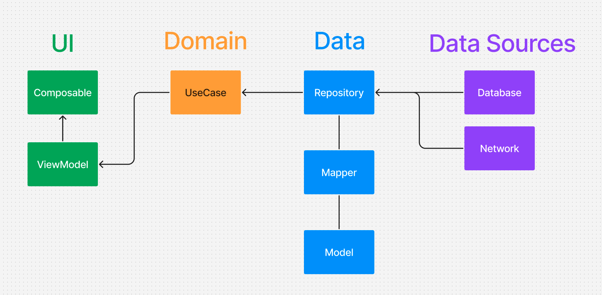

# CosmosNow
CosmosNow is an app which demonstrates modern Android development with Jetpack Compose, Hilt, Coroutines, Jetpack (Room, ViewModel) and Material Design with DarkMode. Also shows approach to modularization with Clean Architecture.

## Tech Stack
- Minimum SDK level 24.
- [Kotlin](https://kotlinlang.org/) based, utilizing [Coroutines](https://github.com/Kotlin/kotlinx.coroutines) + [Flow](https://kotlin.github.io/kotlinx.coroutines/kotlinx-coroutines-core/kotlinx.coroutines.flow/) for asynchronous operations.
- Jetpack Libraries:
    - Jetpack Compose: Android’s modern toolkit for declarative UI development.
    - Lifecycle: Observes Android lifecycles and manages UI states upon lifecycle changes.
    - ViewModel: Manages UI-related data and is lifecycle-aware, ensuring data survival through configuration changes.
    - Navigation: Facilitates screen navigation, complemented by [Hilt Navigation Compose](https://developer.android.com/jetpack/compose/libraries#hilt) for dependency injection.
    - Room: Constructs a database with an SQLite abstraction layer for seamless database access.
    - [Hilt](https://dagger.dev/hilt/): Facilitates dependency injection.
      logic.
- [Retrofit](https://github.com/square/retrofit): Constructs REST APIs and facilitates paging network data retrieval.
- [ksp](https://github.com/google/ksp): Kotlin Symbol Processing API for code generation and analysis.
- [Turbine](https://github.com/cashapp/turbine): A small testing library for kotlinx.coroutines Flow.
- [Coil](https://github.com/coil-kt/coil): An image loading library for Android
- [Paparazzi](https://github.com/cashapp/paparazzi): An Android library to render your application screens without a physical device or emulator.

## Architecture
Based on Clean Architecture separates app into different layers which makes application more scalable friendly and testable as well.

## GithubAction CI
- `:domain`: Tests core business logic to ensure correct application behavior.
- `:core:common`: Validates common utilities and helper functions for consistency and reliability.
- `:webservice`: Verifies API contracts to ensure endpoints handle requests and responses correctly.
- `:screenshots`: Ensures screenshot generation maintains visual accuracy and consistency.